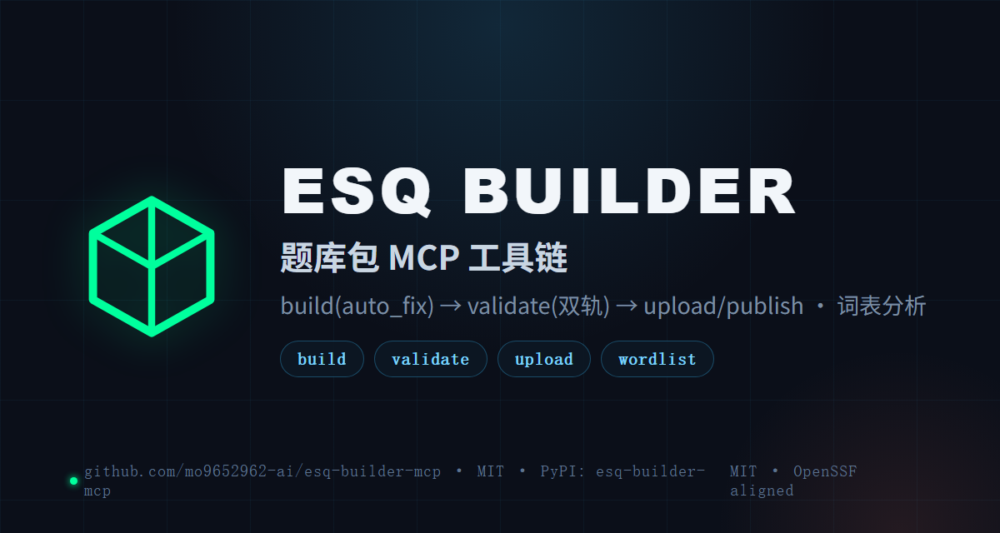

<div align="center">

  

  # ESQ BUILDER MCP

  **Question-bank freedom · dual-track validation · auto-fix with audit trail · one-line uvx**

  **esq-builder-mcp turns the ESQ 1.0 exam-package toolchain into 5 MCP tools: build (with automatic mechanical-pitfall repair) → validate (vendored + official CLI dual-track) → upload/publish (503 retry), plus kajweb wordlist parsing and hot-word statistics. Listed on the [MCP Registry](https://registry.modelcontextprotocol.io).**

  <p>
    <a href="README.md">🇨🇳 中文</a>
    ·
    <a href="https://pypi.org/project/esq-builder-mcp/">PyPI</a>
    ·
    <a href="CHANGELOG.md">CHANGELOG</a>
    ·
    <a href="LICENSE">MIT</a>
  </p>

  <p>
    <a href="https://github.com/mo9652962-ai/esq-builder-mcp/actions/workflows/ci.yml"></a>
    <a href="https://pypi.org/project/esq-builder-mcp/"></a>
    
  </p>
</div>

<div align="center">
  
</div>

## Why

Skills (SKILL.md files) transfer process knowledge, but an LLM re-runs into the same pitfalls every time (ASCII-only keys, double-brace blanks, upload path 405…). This server bakes those fixes into tool code — callers stop hitting them.

| Tool | Purpose | Pitfalls baked in |
|:---|:---|:---|
| `esq_build_package` | Validate + package an ESQ ZIP (optional `auto_fix`) | externalKey must be ASCII 3–200 chars; `{{blank:N}}` double braces; option/candidate keys A–D; correctOption must exist; cloze blanks = question count; manifest required fields + semver |
| `esq_validate_package` | Validate an ESQ package (vendored validator by default, official CLI optional) | dual-track (see below) |
| `esq_upload_and_publish` | Upload + publish to the practice-machine backend | path pinned to `/api/question-banks/imports` (`/upload` returns 405); 503 retried 3× @10s; failed publish hints job_id retry |
| `esq_parse_wordlist` | kajweb/dict JSONL wordlist parsing (.jsonl or book zip) | line-by-line json.loads (whole-file load throws Extra data); wordRank ordering |
| `esq_hot_words` | Hot-word statistics over real-exam passages | since-year filter; stopwords; `[a-zA-Z][a-zA-Z'-]{3,}` |

### auto_fix

`esq_build_package(auto_fix=true)` repairs purely mechanical pitfalls before validation, with every fix recorded in the returned `fixes` array: non-ASCII external keys rebuilt as `cn.xxx.y2021.u1` (answer keys renamed in sync), single-brace `{blank:N}` → `{{blank:N}}`, missing `unit.sequence` backfilled, sub-standard blockKeys normalized. Judgment problems (blank count ≠ question count, answer not in options) are **never** silently fixed.

### Dual-track validation

`esq_validate_package` has two channels (the `validator` field in the response tells you which ran): the **vendored validator** (`esq_validator.py`, zero external dependencies) by default, and the **official CLI** via `validator_path` or `ESQ_VALIDATOR_PATH` for reconciliation. Conformance is guarded by `tests/test_validator_conformance.py`.

## 🚀 Quick start

```bash
uvx esq-builder-mcp        # stdio · any MCP client
```

Register (ZCode `~/.zcode/cli/config.json` → mcpServers, or Claude Desktop):

```json
{ "mcpServers": { "esq-builder": { "command": "uvx", "args": ["esq-builder-mcp"] } } }
```

## Testing

```bash
uv run pytest -v           # 111 tests incl. vendored-vs-official conformance
uv run ruff check src tests && uv run bandit -r src -q --skip B101
```

## License

MIT
