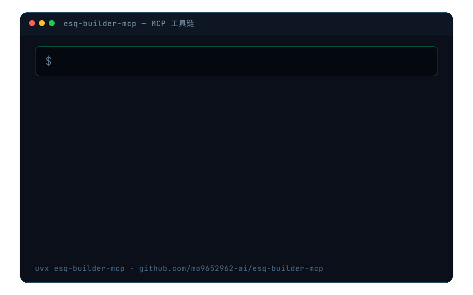

<div align="center">

  

  # ESQ BUILDER MCP

  **题库包自由 · 双轨校验 · auto_fix 修复留痕 · uvx 一行接入**

  **esq-builder-mcp 把 ESQ 1.0 题库包工具链固化为 5 个 MCP 工具：构建（自动修复机械性坑）→ 校验（内置 vendored + 官方 CLI 双轨）→ 上传发布（503 重试），外加 kajweb 词表解析与真题热点词统计。已上架 [MCP Registry](https://registry.modelcontextprotocol.io)。**

  <p>
    <a href="README.en.md">English</a>
    ·
    <a href="#-工具参数参考">📐 参数参考</a>
    ·
    <a href="CHANGELOG.md">CHANGELOG</a>
    ·
    <a href="https://registry.modelcontextprotocol.io">MCP Registry</a>
    ·
    <a href="LICENSE">MIT</a>
  </p>

  <p>
    <a href="https://github.com/mo9652962-ai/esq-builder-mcp/actions/workflows/ci.yml"></a>
    <a href="https://github.com/mo9652962-ai/esq-builder-mcp/actions/workflows/codeql.yml"></a>
    <a href="https://pypi.org/project/esq-builder-mcp/"></a>
    
    
    <a href="LICENSE"></a>
    
    
  </p>
</div>

<div align="center">
  
</div>

<div align="center">
  
  <p><sub>▲ 5 个 MCP 工具 · PyPI 5 个版本 · <a href="https://pypi.org/project/esq-builder-mcp/">PyPI</a> / <a href="https://registry.modelcontextprotocol.io">MCP Registry</a> 双上架</sub></p>
</div>

<div align="center">

### ⭐ 如果 esq-builder-mcp 对你有帮助，点个 Star 就是最大的支持

[](https://github.com/mo9652962-ai/esq-builder-mcp/stargazers)
[](LICENSE)
[](https://github.com/mo9652962-ai/esq-builder-mcp/actions)
[](https://github.com/mo9652962-ai/esq-builder-mcp/releases)

[](https://star-history.com/#mo9652962-ai/esq-builder-mcp&Date)

</div>

<!-- mcp-name: io.github.mo9652962-ai/esq-builder-mcp -->

## 为什么

技能（SKILL.md）传的是流程知识，LLM 每次执行都可能踩坑（ASCII key、双花括号、上传路径 405……）。本 server 把这些坑固化进工具代码——调用方不会再遇到它们。

| 工具 | 作用 | 固化的坑 |
|:---|:---|:---|
| `esq_build_package` | 校验 + 打包 ESQ ZIP（可选 `auto_fix`） | externalKey 纯 ASCII 3-200 位；`{{blank:N}}` 双花括号；option/candidates key 单大写字母；correctOption 必须存在于选项；cloze 空位数=题数；manifest 必填字段 + semver |
| `esq_validate_package` | 校验 ESQ 包（默认内置校验器，可选官方 CLI 对账） | 双轨校验（见下） |
| `esq_upload_and_publish` | 上传 + 发布到刷题机后端 | 路径写死 `/api/question-banks/imports`（`/upload` 会 405）；503 重试 3 次间隔 10s；publish 失败时提示用 job_id 单独重试 |
| `esq_parse_wordlist` | kajweb/dict JSONL 高频词解析（.jsonl 或 book zip） | 逐行 json.loads（整文件 load 报 Extra data）；wordRank 排序 |
| `esq_hot_words` | 真题 passage 热点词统计 | 近两年过滤；去停用词；`[a-zA-Z][a-zA-Z'-]{3,}` |

### auto_fix：机械性坑自动修复

`esq_build_package(auto_fix=true)` 在校验前自动修复「纯机械」的坑，修复明细记录在返回值 `fixes` 数组（审计）：

- 含中文/非法字符的 packageId/paperKey/unitKey/questionKey → `cn.xxx.y2021.u1` 风格重建，**answers 两级键自动同步改名**
- 单花括号 `{blank:N}` → 双花括号 `{{blank:N}}`
- 缺失的 `unit.sequence` 补 index+1；不达标 blockKey（如 2 位的 `p1`）归一为 `block-{index}`

判断性问题（空位数≠题数、答案不在选项中）**不会**被静默修复，仍走「拒绝 + 可行动错误」。默认 `false` 保持严格行为。

### 双轨校验

`esq_validate_package` 有两条通道，返回值 `validator` 字段标明所用通道：

- **默认：内置校验器**（`esq_validator.py`，vendor 自 backend/app/services/esq.py 校验子集，import 调用）——零外部依赖，PyPI/uvx/PyInstaller 分发可用；
- **对账：官方 CLI**——显式传 `validator_path` 或设 `ESQ_VALIDATOR_PATH` 时走 subprocess 调官方校验器。

两条通道的一致性由 `tests/test_validator_conformance.py` 守护（本机有刷题机仓库时自动执行；后端校验逻辑变更后先跑它再同步 vendored 副本）。

## 🚀 快速开始

```bash
# PyPI（任意 MCP 客户端，无需 clone）
uvx esq-builder-mcp              # stdio 模式

# Windows 单文件 exe：到 Releases 下载 esq-builder-mcp.exe，客户端 command 直指该 exe
```

ZCode（`~/.zcode/cli/config.json` → mcpServers）或其他客户端：

```json
{
  "mcpServers": {
    "esq-builder": {
      "command": "uvx",
      "args": ["esq-builder-mcp"]
    }
  }
}
```

> Windows 下 MCP 命令参数一律用正斜杠路径（Codex config.toml 转义坑的同款规避）。

## 📐 工具参数参考

以下参数表与 `src/esq_builder_mcp/server.py` 的实际签名逐一对应。

### esq_build_package

| 参数 | 类型 | 必填 | 默认 | 说明 |
|:---|:---|:---:|:---|:---|
| `manifest` | object | 是 | — | `{packageId, contentVersion, title, subject, publisher, license:{notice}, source:{description}}` |
| `papers` | array | 是 | — | `[{paperKey, year, units:[{unitKey, type(cloze\|reading\|part_b), title, sequence, passage?, candidates?, questions:[...]}]}]`；cloze 用 `{{blank:N}}` 双花括号标空位、词库题写 `unit.candidates`；reading 的 questions 写 `options` |
| `answers` | object | 是 | — | `{paperKey: {questionKey: {correctOption, score}}}` —— 每空必填，`correctOption` 必须存在于该题选项 |
| `output_path` | string | 是 | — | 输出 ZIP 绝对路径 |
| `auto_fix` | boolean | 否 | `false` | 见上节；修复明细在返回值 `fixes` 数组 |

返回 `{ok, zip_path, totals, errors, fixes, warnings}`。

### esq_validate_package

| 参数 | 类型 | 必填 | 默认 | 说明 |
|:---|:---|:---:|:---|:---|
| `zip_path` | string | 是 | — | ESQ 包路径 |
| `validator_path` | string | 否 | （内置校验器） | 指定后改走官方校验器 CLI subprocess 对账；也可用环境变量 `ESQ_VALIDATOR_PATH` |

返回 `{valid, errors|totals, validator}`；`valid=true` 且 0 errors 才可上传。

### esq_upload_and_publish

| 参数 | 类型 | 必填 | 默认 | 说明 |
|:---|:---|:---:|:---|:---|
| `zip_path` | string | 是 | — | ESQ 包路径（上传前先 `esq_validate_package`） |
| `base_url` | string | 否 | `http://127.0.0.1:8765` | 刷题机后端地址（需先启动后端） |
| `profile_id` | integer | 否 | （后端当前激活级别） | 题库 profile |
| `publish` | boolean | 否 | `true` | 是否发布；publish 失败时上传已成功，用返回的 `job_id` 单独重试 |

返回 `{ok, job_id, uploaded, published}`。

### esq_parse_wordlist

| 参数 | 类型 | 必填 | 默认 | 说明 |
|:---|:---|:---:|:---|:---|
| `jsonl_path` | string | 是 | — | kajweb/dict 高频词表 JSONL 或 book zip 路径 |
| `top_n` | integer | 否 | （全部） | 只取前 N 个（如四级核心词取 1162） |
| `level` | string | 否 | （不标注） | 级别名（如「四级·高频」） |

返回 `{ok, count, bad_lines, words:[{rank, word, phonetic, translations, synonyms}]}`。

### esq_hot_words

| 参数 | 类型 | 必填 | 默认 | 说明 |
|:---|:---|:---:|:---|:---|
| `texts` | array | 是 | — | `[{year: 2024, text: "passage 正文"}, ...]`（或纯字符串列表） |
| `since_year` | integer | 否 | `2023` | 只统计该年份之后的真题（默认近两年热点） |
| `top_n` | integer | 否 | `300` | 取前 N 个 |
| `extra_stopwords` | array | 否 | （无） | 额外停用词 |

返回 `{ok, texts_scanned, unique_words, hot_words:[{term, count}]}`。

## 🧪 测试

```bash
uv run pytest -v          # 111 项；含 vendored vs 官方 CLI 一致性对账（无刷题机环境自动 skip）
uv run ruff check src tests && uv run bandit -r src -q --skip B101   # lint 与安全静态扫描（CI 同款）
```

## 🌍 环境变量

| 变量 | 默认 | 说明 |
|:---|:---|:---|
| `ESQ_VALIDATOR_PATH` | （未设） | 设定后 `esq_validate_package` 改走官方校验器 CLI（对账/仲裁通道） |

## 🔁 与技能的关系

- 上游技能：`~/.agents/skills/esq-question-bank-import/SKILL.md`（流程与数据源）
- 本 server 是其「确定性环节」的工具化；AI 标注答案等 LLM 判断环节仍在技能侧。

## License

MIT

---

📌 **更多**：[作者仓库矩阵](https://github.com/mo9652962-ai)（墨题刷题机 / 第二大脑 / 安全三部曲 / 孵化线）
